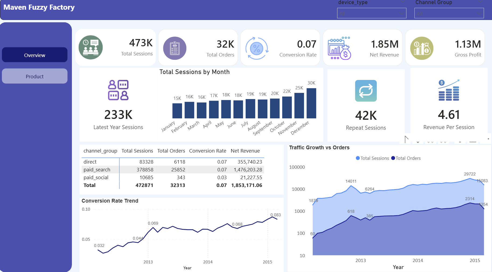
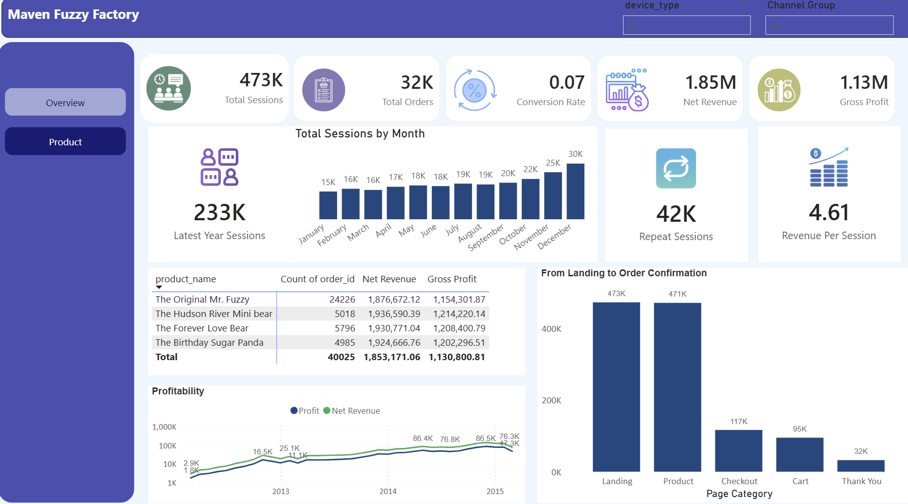

# 🧸 Maven Fuzzy Factory – E-Commerce Analytics Project

---

## 📑 Table of Contents

1. [Project Overview](#1-project-overview)  
2. [Tools & Technologies](#2-tools--technologies)  
3. [Dataset Overview](#3-dataset-overview)  
4. [Python – Data Preparation & Exploration](#4-python--data-preparation--exploration)  
   - 4.1 [Data Loading & Preparation](#41-data-loading--preparation)  
   - 4.2 [Important Python Results](#42-important-python-results)  
   - 4.3 [Performance Analysis](#43-performance-analysis)  
5. [SQL – Business Analysis](#5-sql--business-analysis)  
   - 5.1 [Business Performance Analysis](#business-performance-analysis)  
   - 5.2 [Funnel User Behavior Analysis](#funnel-user-behavior-analysis)  
   - 5.3 [Product Performance Analysis](#product-performance-analysis)  
   - 5.4 [Refund Impact Analysis](#refund-impact-analysis)  
  
6. [Power BI Dashboard](#6-power-bi-dashboard)  
   - [6.1 Page 1 – Executive Overview](#61-page-1--executive-overview)  
   - [6.2 Page 2 – Product](#62-page-2--product)  
 
7. [Business Recommendations](#7-business-recommendations)  
8. [Limitations](#8-limitations)  
9. [Future Improvements](#9-future-improvements)

---

# 1. Project Overview

This project analyzes the performance of Maven Fuzzy Factory, an e-commerce company selling teddy bears. The objective was to evaluate business growth, marketing effectiveness, customer behavior, and profitability using Python, SQL, and Power BI.

The analysis focuses on:

- Website session trends  
- Order growth  
- Conversion performance  
- Marketing channel effectiveness  
- Revenue and profitability metrics  
- Repeat customer behavior  
- Funnel drop-off analysis  

---

# 2. Tools & Technologies

- **Python (Jupyter Notebook)** → Data cleaning & exploration  
- **PostgreSQL (pgAdmin)** → Business logic & KPI analysis  
- **Power BI** → Dashboard development & visualization  

---

# 3. Dataset Overview

Tables used:

- website_sessions  
- website_pageviews  
- orders  
- order_items  
- products  
- order_item_refunds  

Each table supports traffic, behavior, product, and financial analysis.

---

# 4. Python – Data Preparation & Exploration

The data preparation and exploratory analysis phase was conducted in Python using Pandas and Matplotlib to ensure data integrity and generate meaningful performance insights.

---

## 4.1 Data Loading & Preparation

- Loaded all CSV datasets into Pandas DataFrames  
- Converted all created_at columns to datetime format for time-based analysis  
- Checked for missing (null) values in all key columns  
- Validated primary keys to ensure no duplicates in:  
  - website_session_id  
  - order_id  
- Verified table relationships between:  
  - Sessions table  
  - Orders table  
- Created a channel_grouping column to categorize traffic sources into:  
  - Paid Search  
  - Direct  
  - Paid Social  
- Confirmed referential integrity before joining tables  

This step ensured the dataset was clean, accurate, and analysis-ready.

---

## 4.2 Important Python Results

The table below summarizes traffic performance, conversion efficiency, and revenue contribution by marketing channel.

| channel_group | sessions | orders | revenue | conversion_rate | revenue_per_session |
|--------------|----------|--------|----------|-----------------|--------------------|
| direct | 83328 | 6118 | 371433.03 | 0.073421 | 4.457482 |
| paid_search | 378858 | 25852 | 1544817.39 | 0.068237 | 4.077563 |
| paid_social | 10685 | 343 | 22259.33 | 0.032101 | 2.083232 |

---

## 4.3 Performance Analysis

### Traffic Volume

Paid Search generates the highest number of sessions (378,858), significantly outperforming other channels. This confirms that paid acquisition is the primary traffic driver for the business.

### Conversion Efficiency

Direct traffic has the highest conversion rate (7.34%), followed by Paid Search (6.82%). Paid Social significantly underperforms at 3.21%.

This suggests:

- Direct visitors show stronger purchase intent.  
- Paid Social traffic may not be highly qualified.  

### Revenue Impact & Quality

Although Paid Search drives the most revenue ($1.54M), Direct traffic generates the highest revenue per session ($4.46).

This indicates:

- Direct channel delivers higher value per visitor.  
- Paid Social not only converts less but also generates lower revenue per session.  

---

# 5.  SQL – Business Analysis

In this project, SQL was used to perform structured business analysis across four key areas: overall performance, user funnel behavior, product performance, and refund impact. Complex joins, aggregations, grouping, and KPI calculations were applied to extract actionable insights.

---

## 5.1 Business Performance Analysis

SQL was used to analyze overall company performance metrics including:

- Total sessions  
- Total orders  
- Revenue  
- Conversion rate  
- Revenue per session  

This involved:

- Joining sessions and orders tables  
- Grouping results by time period and traffic channel  
- Calculating key KPIs using COUNT(), SUM(), and derived ratios  

**Objective:**  
To understand revenue growth, traffic trends, and overall business performance over time.

It helps to identifiy which traffic sources drive the highest revenue and how efficiently traffic converts into sales.

---

## 5.2 Funnel User Behavior Analysis

SQL was used to analyze user progression through the website funnel stages, including:

- Session start  
- Product page views  
- Cart page views  
- Checkout  
- Order completion  

This required:

- Tracking users across different page URLs  
- Using conditional aggregations  
- Calculating drop-off rates between funnel stages  

**Objective:**  
To identify where users drop off in the conversion funnel.

It Highlights bottlenecks in the user journey and potential optimization areas to improve conversion rates.

---

## 5.3 Product Performance Analysis

SQL was used to evaluate product-level performance by calculating:

- Orders per product  
- Revenue per product  
- Product conversion rates  
- Cross-sell performance  

This included:

- Joining order_items with products  
- Aggregating revenue by product_id  
- Comparing product performance over time  

**Objective:**  
To determine best-selling products and high-margin opportunities.

This Identifies top revenue-driving products and underperforming items that may require repositioning or marketing adjustments.

---

## 5.4 Refund Impact Analysis

SQL was used to measure how refunds affect revenue and profitability by calculating:

- Total refunds by product  
- Refund rate  
- Net revenue after refunds  

This required:

- Joining order_items with order_item_refunds  
- Calculating refund rates using conditional counts  
- Adjusting revenue metrics to account for refunds  

**Objective:**  
To assess the financial impact of product returns.

This analysis reveals which products contribute most to revenue leakage and identified areas where quality or customer satisfaction may need improvement.

---

# 6. Power BI Dashboard

An interactive Power BI dashboard was developed to transform SQL-based analysis into executive-level insights. The dashboard provides a comprehensive view of traffic growth, sales performance, marketing effectiveness, and product profitability.

---

## 6.1 Page 1 – Executive Overview

The Overview page presents a high-level summary of overall business performance.

### Key KPIs Displayed:

- 473K Total Sessions  
- 32K Total Orders  
- 7% Conversion Rate  
- $1.85M Net Revenue  
- $1.13M Gross Profit  
- $4.61 Revenue per Session  
- 42K Repeat Sessions  

These KPIs allow quick evaluation of scale, efficiency, and profitability.

### Trend Analysis

- Total Sessions by Month shows consistent traffic growth, reaching ~30K sessions in peak months.  
- Traffic Growth vs Orders demonstrates that order growth closely follows traffic growth, confirming scalable demand.  
- Conversion Rate Trend shows strong improvement over time, increasing from ~3% in early periods to over 8% in later periods.  

This confirms the business improved both acquisition and conversion efficiency.

### Channel Performance Table

The dashboard compares:

- Sessions  
- Orders  
- Conversion Rate  
- Net Revenue  

across different marketing channels (Direct, Paid Search, Paid Social), highlighting:

- Paid Search drives the highest traffic and revenue.  
- Direct traffic shows strong efficiency.  
- Paid Social underperforms relative to other channels.  

Interactive slicers (Device Type & Channel Group) allow dynamic filtering for deeper analysis.

---

## 6.2 Page 2 – Product

The Product page focuses on item-level performance and funnel behavior.

### Product Performance Table

Displays:

- Order Count  
- Net Revenue  
- Gross Profit  

Top-performing products such as:

- The Original Mr. Fuzzy  
- Forever Love Bear  
- Hudson River Mini Bear  

are compared based on profitability and revenue contribution.

This enables identification of high-margin products and revenue drivers.

### Profitability Trend

A time-series visualization compares Net Revenue and Profit, showing:

- Strong revenue scaling over time  
- Consistent profitability margins  

This confirms sustainable revenue growth rather than low-margin expansion.

### Funnel Analysis – From Landing to Order Confirmation

The funnel visual shows drop-offs across key stages:

Landing → Product → Checkout → Cart → Thank You

While 473K users land on the site, only 32K reach the final purchase stage.

This highlights conversion drop-off points and potential optimization opportunities in:

- Cart abandonment  
- Checkout friction  
- User experience  

---

# 7. Business Recommendations

- Continue investing in Paid Search as it drives the highest traffic and revenue.  
- Strengthen Direct traffic strategies to maximize high conversion efficiency.  
- Improve Paid Social targeting and campaign optimization to increase performance.  
- Optimize the checkout process to reduce funnel drop-offs and improve conversion rate.  
- Focus marketing efforts on high-profit products to maximize margins.  

---

# 8. Limitations

- Marketing cost data was not included, so full ROI analysis was not possible.  
- The dataset represents historical data and may not reflect current trends.  
- Customer lifetime value and cohort analysis were not explored.  

---

# 9. Future Improvements

- Incorporate advertising spend to measure ROI and CPA.  
- Conduct cohort and retention analysis for deeper customer insights.  
- Implement predictive forecasting to support future planning.  
- Enable real-time dashboard integration for continuous monitoring.  

---
